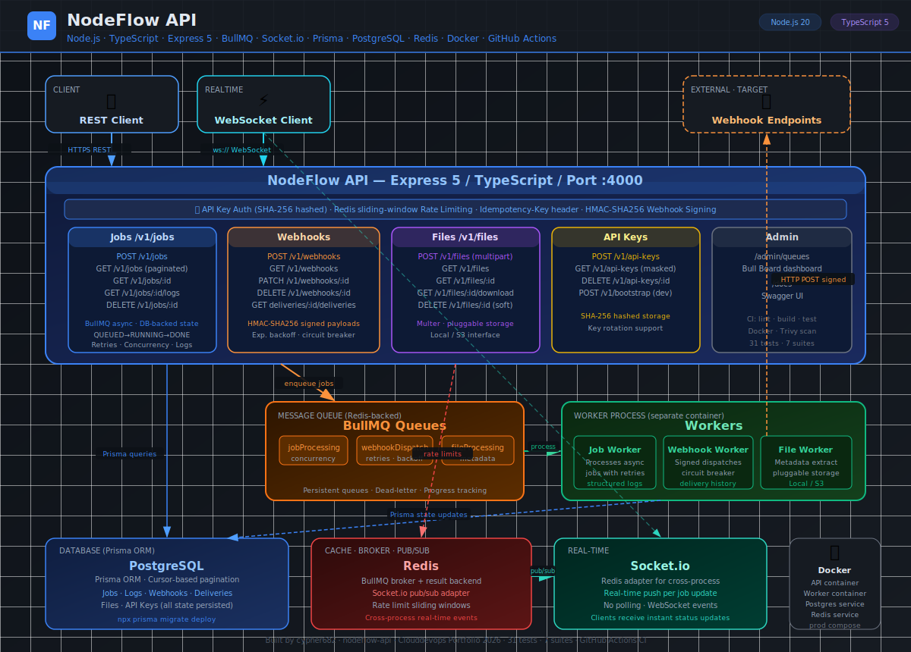

# nodeflow-api

[](https://github.com/cypher682/nodeflow-api/actions/workflows/ci.yml)

Asynchronous job orchestration and webhook delivery API built with Node.js, TypeScript, BullMQ, Socket.io, Prisma, PostgreSQL, Redis, Docker, and GitHub Actions.

NodeFlow is a multi-process distributed backend service — not a CRUD API with a background task bolted on. Two separate Node.js processes share state through Redis and PostgreSQL with no direct coupling between them.

---

## Highlights

- Two-process architecture: Express API and BullMQ Worker as separate Node.js processes
- Job lifecycle: `QUEUED` → `RUNNING` → `SUCCEEDED` / `FAILED` / `CANCELLED` with structured log entries
- Real-time job status via Socket.io, bridged cross-process through Redis pub/sub
- Webhook engine: HMAC-SHA256 signatures, exponential backoff, Redis circuit breaker
- Idempotency middleware: `Idempotency-Key` caches responses in Postgres — safe replay, no duplicate side effects
- File upload pipeline with pluggable storage interface (`LocalStorageProvider` / S3-ready)
- API key authentication with SHA-256 hashed keys — plaintext never stored
- Redis sliding-window rate limiting with standard `X-RateLimit-*` headers
- API versioning middleware with deprecation headers
- Bull Board visual queue dashboard at `/admin/queues`
- 31 tests across 7 suites
- GitHub Actions CI: lint → TypeScript build → Jest → Docker build (API + Worker) → Trivy scan

---

## Tech Stack

| Area | Tools |
|---|---|
| API | Node.js, TypeScript, Express 5 |
| Queue | BullMQ, Redis |
| ORM | Prisma, PostgreSQL |
| Real-time | Socket.io, `@socket.io/redis-adapter`, `@socket.io/redis-emitter` |
| Validation | Zod |
| Testing | Jest, Supertest |
| Delivery | Docker, Docker Compose, GitHub Actions, Trivy |

---

## Architecture



```
Client
  │
  ▼
Express API (port 4000)
  │── POST /v1/jobs      → validates, writes Job to DB, enqueues to BullMQ
  │── GET  /v1/jobs/:id  → reads job state from PostgreSQL
  │── Socket.io server   → pushes real-time status events to connected clients
  │── Bull Board         → /admin/queues visual dashboard
  │── Swagger UI         → /docs
  │
  └──► Redis (BullMQ queues: job-processing, webhook-dispatch, file-processing)
         │
         ▼
    BullMQ Worker Process
         │── picks up job from queue
         │── updates DB state (RUNNING → SUCCEEDED / FAILED)
         │── emits job:status via Redis pub/sub → forwarded to Socket.io clients
         │── dispatches webhook delivery
         │── writes structured logs to PostgreSQL
         ▼
    PostgreSQL — durable state: jobs, logs, webhooks, deliveries, files, API keys
```

The API and Worker share no memory and hold no references to each other. This is the same shape as a Kubernetes deployment: two separate Deployments, one managed Redis, one managed database.

---

## API Surface

| Method | Path | Purpose |
|---|---|---|
| `GET` | `/health` | Service health |
| `POST` | `/v1/jobs` | Submit a job |
| `GET` | `/v1/jobs` | List jobs (cursor pagination) |
| `GET` | `/v1/jobs/:id` | Get job by ID |
| `DELETE` | `/v1/jobs/:id` | Cancel a queued job |
| `GET` | `/v1/jobs/:id/logs` | Get structured job logs |
| `POST` | `/v1/files` | Upload a file |
| `GET` | `/v1/files` | List files |
| `GET` | `/v1/files/:id` | Get file metadata |
| `GET` | `/v1/files/:id/download` | Download file |
| `DELETE` | `/v1/files/:id` | Delete file |
| `POST` | `/v1/webhooks` | Register a webhook endpoint |
| `GET` | `/v1/webhooks` | List webhooks |
| `GET` | `/v1/webhooks/:id` | Get webhook |
| `PATCH` | `/v1/webhooks/:id` | Update webhook |
| `DELETE` | `/v1/webhooks/:id` | Delete webhook |
| `GET` | `/admin/queues` | Bull Board dashboard |
| `GET` | `/docs` | Swagger UI |

---

## Local Development

**Prerequisites:** Docker Desktop and Node.js 20+

Copy the example env file:

```bash
cp .env.example .env
```

Start PostgreSQL and Redis:

```bash
docker compose up -d postgres redis
```

Install dependencies and run migrations:

```bash
npm install
npx prisma generate
npx prisma migrate deploy
```

Start the API and Worker:

```bash
npm run dev         # API on port 4000
npm run dev:worker  # Worker in a second terminal
```

Open:

```
http://localhost:4000/docs         — Swagger UI
http://localhost:4000/admin/queues — Bull Board
```

Run tests:

```bash
npm test
```

Run linter and TypeScript check:

```bash
npm run lint
npm run build
```

---

## Key Implementation Decisions

**Two-process architecture, not a background thread**
The API and Worker are separate `node` processes. They share no memory and have no imports of each other. Redis is the only channel between them. This makes the Worker independently scalable and directly maps to a Kubernetes multi-Deployment pattern.

**Cross-process Socket.io via Redis pub/sub**
The WebSocket server lives in the API process. The Worker has no access to it. `@socket.io/redis-emitter` lets the Worker publish events into Redis; `@socket.io/redis-adapter` on the API subscribes and forwards to the correct WebSocket room. Neither process references the other. The same setup works across multiple API pods in Kubernetes without changing application code.

**Redis circuit breaker for webhook delivery**
Exponential backoff handles transient failures. But if an endpoint is completely dead, retrying with backoff still fires requests into the void. The circuit breaker tracks consecutive failures per URL in Redis. After 5 failures, the circuit opens for 5 minutes — deliveries skip the HTTP call entirely and fail immediately. Success clears the counter. This is the same pattern used in production service meshes, implemented at the application layer.

**Idempotency via `res.json()` interception**
The idempotency middleware wraps `res.json()` to capture the response after it runs, then stores `(hashedKey, userId, status, body)` in Postgres asynchronously. On a duplicate request, the stored response is returned before the handler runs. No side effects replay. This is the same pattern Stripe uses for payment safety.

**API keys stored as SHA-256 hashes**
The raw API key is shown to the user once at creation and never stored. Every authenticated request re-hashes the presented key and looks it up. If the database is compromised, no plaintext keys are exposed.

---

## CI/CD

Workflow: `.github/workflows/ci.yml`

| Job | What it does |
|---|---|
| `lint-and-test` | ESLint, TypeScript compile, Jest with live Postgres + Redis service containers |
| `docker-build` | Multi-stage API image build, multi-stage Worker image build, Trivy scan on both |
| `deploy` | Railway deploy stub — requires `RAILWAY_TOKEN` secret |

---

## Security Notes

- API keys stored as SHA-256 hashes — raw key never persisted after creation
- Webhook payloads signed with HMAC-SHA256 — receivers can verify authenticity
- Rate limiting returns standard `X-RateLimit-Limit`, `X-RateLimit-Remaining`, `Retry-After` headers
- Idempotency keys hashed with userId — keys from different users do not collide
- `.env` is gitignored and must not be committed

---

## Deployment

Railway deployment is prepared. CI has a deploy job that triggers on push to `main`.

To activate: add `RAILWAY_TOKEN` as a repository secret and configure service IDs.

Live URL: not deployed yet.

---

## Evidence

| Evidence | Location |
|---|---|
| Architecture diagram | `nodeflow_architecture.svg` |
| Swagger UI | `/docs` when running locally |
| Bull Board | `/admin/queues` when running locally |
